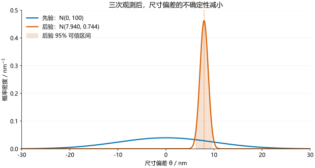
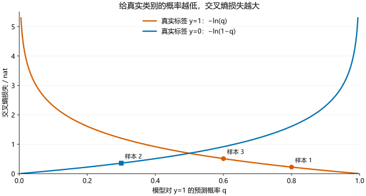

# 人工智能课程作业：奇异值分解、贝叶斯推断与交叉熵

姓名：曹立涛　学号：2026710230班级：光学工程（学硕）

日期：2026 年 10 月 8 日

本作业依次完成三项任务：推导奇异值分解并设计手算例子；以纳米光子学器件共振波长反演为项目案例，建立贝叶斯数学模型；解释交叉熵的定义、原理与应用，并计算分类损失和一次梯度更新。仿真方案使用 Lumerical FDTD。文中光学案例的数值为教学构造数据，真实项目需要用仿真扫描、加工统计与实验观测替换它们。

## 符号约定

- 矩阵转置记为 $A^\mathsf T$，向量采用列向量；矩阵讨论限于实数情形。
- $\mathcal N(\mu,v)$ 的第二个参数为方差，标准差为 $\sqrt v$。
- 交叉熵采用自然对数 $\ln$，单位为 nat；贝叶斯案例中的几何尺寸和波长以 nm 为单位。
- 三部分各自定义局部符号；例如贝叶斯反演中的 $\theta$ 表示尺寸偏差，分类模型中的 $\theta$ 表示模型参数。

## 一、奇异值分解的推导与自设计例子

### 1.1 定义和矩阵尺寸

设 $A\in\mathbb{R}^{m\times n}$，$r=\operatorname{rank}(A)$，$q=\min(m,n)$。奇异值分解（singular value decomposition，SVD）将任意实矩阵表示为

$$
A=U\Sigma V^\mathsf{T},
$$

其中 $U\in\mathbb{R}^{m\times m}$ 和 $V\in\mathbb{R}^{n\times n}$ 是正交矩阵，即

$$
U^\mathsf{T}U=I_m,\qquad V^\mathsf{T}V=I_n.
$$

$\Sigma\in\mathbb{R}^{m\times n}$ 为矩形对角矩阵，对角元素满足

$$
\sigma_1\ge\sigma_2\ge\cdots\ge\sigma_r>0,
\qquad \sigma_{r+1}=\cdots=\sigma_q=0.
$$

这里 $\sigma_i$ 称为奇异值；$U$ 的列 $u_i$ 和 $V$ 的列 $v_i$ 分别称为左、右奇异向量。正奇异值的个数等于矩阵的秩。与通常的特征值分解相比，SVD 不要求 $A$ 为方阵或对称矩阵。

### 1.2 从谱定理构造 SVD

#### 第一步：证明 $A^\mathsf{T}A$ 对称半正定

令 $B=A^\mathsf{T}A$，则

$$
B^\mathsf{T}=(A^\mathsf{T}A)^\mathsf{T}=A^\mathsf{T}A=B.
$$

对任意 $x\in\mathbb{R}^n$，有

$$
x^\mathsf{T}Bx
=x^\mathsf{T}A^\mathsf{T}Ax
=(Ax)^\mathsf{T}(Ax)
=\|Ax\|_2^2\ge0.
$$

因此 $B$ 是实对称半正定矩阵。由实对称矩阵的谱定理，存在一组标准正交特征向量 $v_1,\ldots,v_n$，使

$$
Bv_i=\lambda_i v_i,
\qquad \lambda_1\ge\cdots\ge\lambda_n\ge0,
$$

并且

$$
B=V\Lambda V^\mathsf{T},
\quad V=[v_1\ \cdots\ v_n],
\quad \Lambda=\operatorname{diag}(\lambda_1,\ldots,\lambda_n).
$$

因为

$$
A^\mathsf{T}Ax=0
\iff \|Ax\|_2^2=0
\iff Ax=0,
$$

所以 $\ker(A^\mathsf{T}A)=\ker(A)$，从而

$$
\operatorname{rank}(A^\mathsf{T}A)=\operatorname{rank}(A)=r.
$$

这说明 $\lambda_1,\ldots,\lambda_r>0$，其余特征值均为零。定义

$$
\boxed{\sigma_i=\sqrt{\lambda_i},\quad i=1,\ldots,r.}
$$

#### 第二步：由右奇异向量构造左奇异向量

对每个正奇异值，定义

$$
\boxed{u_i=\frac{Av_i}{\sigma_i},\quad i=1,\ldots,r.}
$$

检验其正交性：

$$
u_i^\mathsf{T}u_j
=\frac{v_i^\mathsf{T}A^\mathsf{T}Av_j}{\sigma_i\sigma_j}
=\frac{\lambda_j v_i^\mathsf{T}v_j}{\sigma_i\sigma_j}
=\begin{cases}
1,&i=j,\\
0,&i\ne j.
\end{cases}
$$

因此 $u_1,\ldots,u_r$ 是标准正交向量，且

$$
Av_i=\sigma_i u_i.
$$

同时，由 $A^\mathsf{T}Av_i=\sigma_i^2v_i$ 可得

$$
A^\mathsf{T}u_i
=\frac{A^\mathsf{T}Av_i}{\sigma_i}
=\sigma_i v_i,
$$

从而

$$
AA^\mathsf{T}u_i=\sigma_i^2u_i.
$$

所以左奇异向量也是 $AA^\mathsf{T}$ 的特征向量，$A^\mathsf{T}A$ 与 $AA^\mathsf{T}$ 的非零特征值相同。

#### 第三步：处理零奇异值并补齐正交基

当 $i>r$ 时，$\lambda_i=0$，于是

$$
\|Av_i\|_2^2=v_i^\mathsf{T}A^\mathsf{T}Av_i=0,
\qquad Av_i=0.
$$

因此这些 $v_i$ 构成 $\ker(A)$ 的标准正交基。对零奇异值不能使用 $u_i=Av_i/\sigma_i$，因为分母为零。

非零奇异值对应的 $u_1,\ldots,u_r$ 张成 $\operatorname{im}(A)$。其正交补为

$$
\operatorname{im}(A)^\perp=\ker(A^\mathsf{T}).
$$

在这个 $m-r$ 维空间中选取一组标准正交基 $u_{r+1},\ldots,u_m$，即可得到完整正交矩阵 $U=[u_1\ \cdots\ u_m]$。

#### 第四步：重构原矩阵

由上述构造，$AV$ 的前 $r$ 列为 $\sigma_i u_i$，其余列为零。因此

$$
AV=U\Sigma.
$$

右乘 $V^\mathsf{T}$，利用 $VV^\mathsf{T}=I_n$，得到

$$
\boxed{A=U\Sigma V^\mathsf{T}.}
$$

也可以写为外积之和：

$$
\boxed{A=\sum_{i=1}^{r}\sigma_i u_i v_i^\mathsf{T}.}
$$

每个 $u_i v_i^\mathsf{T}$ 都是秩为 $1$ 的矩阵，因而 SVD 把 $A$ 分解为 $r$ 个秩为 $1$ 的模式。

#### 完整、薄与紧致形式

三种常见写法仅在是否保留补齐的向量方面不同，重构结果相同：

| 形式 | 左矩阵尺寸 | 中间矩阵尺寸 | 右矩阵转置的尺寸 |
|---|---|---|---|
| 完整 SVD | $m\times m$ | $m\times n$ | $n\times n$ |
| 薄 SVD（经济形式） | $m\times q$ | $q\times q$ | $q\times n$ |
| 紧致 SVD（只保留正奇异值） | $m\times r$ | $r\times r$ | $r\times n$ |

具体地，取 $U_q=[u_1\ \cdots\ u_q]$、$V_q=[v_1\ \cdots\ v_q]$，则

$$
A=U_q\operatorname{diag}(\sigma_1,\ldots,\sigma_q)V_q^\mathsf{T}.
$$

只保留前 $r$ 个正奇异值时，得到

$$
A=U_r\Sigma_rV_r^\mathsf{T}.
$$

当 $r=q$ 时，薄 SVD 与紧致 SVD 相同；当 $r<q$ 时，两者尺寸不同。不同教材有时会将紧致形式也称为“薄 SVD”，所以使用时应同时说明矩阵尺寸。

SVD 的奇异值按大小排序后是确定的，但奇异向量不唯一：同一对 $u_i,v_i$ 可以同时改变符号；重复奇异值对应的子空间内可以同时改变正交基；零空间的补齐正交基也可以有多种选择。

### 1.3 几何解释

对输入向量 $x$，有

$$
Ax=U\bigl(\Sigma(V^\mathsf{T}x)\bigr).
$$

从右向左看，这个变换分为三步：$V^\mathsf{T}$ 在输入空间进行正交变换；$\Sigma$ 沿正交坐标轴按 $\sigma_i$ 缩放，并在必要时增加零坐标或舍去零方向；$U$ 在输出空间进行正交变换。

正交变换保持长度和夹角，可以包含旋转或反射，不能一概称为旋转。关系 $Av_i=\sigma_i u_i$ 表明，输入方向 $v_i$ 被映射到输出方向 $u_i$，长度变为原来的 $\sigma_i$ 倍。在二维非退化情形下，单位圆会变为半轴长为 $\sigma_1,\sigma_2$ 的椭圆；零奇异值对应被压缩为零的方向。

### 1.4 自设计例子：两个变量映射到三个输出

考虑线性映射

$$
\begin{pmatrix}x_1\\x_2\end{pmatrix}
\longmapsto
\begin{pmatrix}x_1+x_2\\x_1\\x_2\end{pmatrix},
$$

其矩阵为

$$
A=\begin{pmatrix}
1&1\\
1&0\\
0&1
\end{pmatrix}.
$$

这个例子不是对角矩阵，需要真正计算特征值和特征向量；其元素简单，又可以完整手算。

#### （1）计算 $A^\mathsf{T}A$ 和奇异值

$$
A^\mathsf{T}A
=\begin{pmatrix}1&1&0\\1&0&1\end{pmatrix}
\begin{pmatrix}1&1\\1&0\\0&1\end{pmatrix}
=\begin{pmatrix}2&1\\1&2\end{pmatrix}.
$$

特征方程为

$$
\det(A^\mathsf{T}A-\lambda I)
=(2-\lambda)^2-1
=(\lambda-3)(\lambda-1)=0.
$$

所以

$$
\lambda_1=3,\qquad \lambda_2=1,
\qquad \boxed{\sigma_1=\sqrt3,\quad \sigma_2=1.}
$$

#### （2）求右奇异向量

$\lambda_1=3$ 时，方程给出 $v_{11}=v_{12}$；$\lambda_2=1$ 时，给出 $v_{21}=-v_{22}$。标准化后选择

$$
v_1=\frac1{\sqrt2}\begin{pmatrix}1\\1\end{pmatrix},
\qquad
v_2=\frac1{\sqrt2}\begin{pmatrix}1\\-1\end{pmatrix}.
$$

因此

$$
V=\frac1{\sqrt2}\begin{pmatrix}1&1\\1&-1\end{pmatrix},
\qquad V^\mathsf{T}V=I_2.
$$

#### （3）求左奇异向量并补齐

$$
u_1=\frac{Av_1}{\sqrt3}
=\frac1{\sqrt6}\begin{pmatrix}2\\1\\1\end{pmatrix},
\qquad
u_2=Av_2
=\frac1{\sqrt2}\begin{pmatrix}0\\1\\-1\end{pmatrix}.
$$

它们满足

$$
\|u_1\|_2^2=\frac{4+1+1}{6}=1,
\quad
\|u_2\|_2^2=\frac{1+1}{2}=1,
\quad
u_1^\mathsf{T}u_2=\frac{1-1}{\sqrt{12}}=0.
$$

求补齐向量时，令 $A^\mathsf{T}u_3=0$。若 $u_3=(a,b,c)^\mathsf{T}$，则 $a+b=0$、$a+c=0$。标准化后可选

$$
u_3=\frac1{\sqrt3}\begin{pmatrix}1\\-1\\-1\end{pmatrix}.
$$

该向量与 $u_1,u_2$ 正交。因此完整分解中的两个矩阵为

$$
U=\begin{pmatrix}
\dfrac2{\sqrt6}&0&\dfrac1{\sqrt3}\\[3pt]
\dfrac1{\sqrt6}&\dfrac1{\sqrt2}&-\dfrac1{\sqrt3}\\[3pt]
\dfrac1{\sqrt6}&-\dfrac1{\sqrt2}&-\dfrac1{\sqrt3}
\end{pmatrix},
\qquad
\Sigma=\begin{pmatrix}\sqrt3&0\\0&1\\0&0\end{pmatrix}.
$$

#### （4）手工乘回原矩阵

先计算

$$
U\Sigma
=\begin{pmatrix}
\sqrt2&0\\
1/\sqrt2&1/\sqrt2\\
1/\sqrt2&-1/\sqrt2
\end{pmatrix}.
$$

再右乘 $V^\mathsf{T}$：

$$
U\Sigma V^\mathsf{T}
=\begin{pmatrix}
\sqrt2&0\\
1/\sqrt2&1/\sqrt2\\
1/\sqrt2&-1/\sqrt2
\end{pmatrix}
\frac1{\sqrt2}\begin{pmatrix}1&1\\1&-1\end{pmatrix}
=\begin{pmatrix}1&1\\1&0\\0&1\end{pmatrix}
=A.
$$

本例 $r=q=2$，薄 SVD 与紧致 SVD 相同，只需保留 $U$ 的前两列和 $\Sigma$ 的前两行。补齐的 $u_3$ 对应输出空间中与 $\operatorname{im}(A)$ 正交的方向，不参与重构。

### 1.5 用同一例子说明最优低秩近似

若只保留最大奇异值对应的一项，得到秩为 $1$ 的近似

$$
A_1=\sigma_1u_1v_1^\mathsf{T}
=\frac12\begin{pmatrix}2&2\\1&1\\1&1\end{pmatrix}
=\begin{pmatrix}1&1\\1/2&1/2\\1/2&1/2\end{pmatrix}.
$$

残差为

$$
A-A_1
=\begin{pmatrix}0&0\\1/2&-1/2\\-1/2&1/2\end{pmatrix}
=\sigma_2u_2v_2^\mathsf{T}.
$$

Frobenius 范数是所有元素平方和的平方根，因此

$$
\|A-A_1\|_F
=\sqrt{4\times(1/2)^2}=1=\sigma_2.
$$

Eckart–Young–Mirsky 定理说明：对 $0\le k<r$，截断 SVD

$$
A_k=\sum_{i=1}^k\sigma_i u_i v_i^\mathsf{T}
$$

在所有秩不超过 $k$ 的矩阵中具有最小 Frobenius 误差，且

$$
\min_{\operatorname{rank}(B)\le k}\|A-B\|_F
=\|A-A_k\|_F
=\sqrt{\sum_{i=k+1}^r\sigma_i^2}.
$$

本例 $\|A\|_F=\sqrt{1+1+1+1}=2$，所以秩 $1$ 近似的相对误差为 $1/2$，保留的平方 Frobenius 范数比例为

$$
\frac{\sigma_1^2}{\sigma_1^2+\sigma_2^2}
=\frac3{3+1}=75\%.
$$

这里的 $75\%$ 表示矩阵平方范数的保留比例。它说明主要模式的大小，不应直接解释成保留了 $75\%$ 的语义信息。

通过本例可以看出，SVD 同时给出矩阵的秩、主要输入输出方向，以及低秩近似的误差。这是它用于图像压缩、数据降维和降噪的基本原因。


这一构造可与 [MIT 18.06 SVD 课程](https://ocw.mit.edu/courses/18-06sc-linear-algebra-fall-2011/pages/positive-definite-matrices-and-applications/singular-value-decomposition/)对照。实际数值计算可直接使用 `numpy.linalg.svd`；手算时通过 $A^\mathsf T A$ 理解构造，不意味着大型数值问题都应先显式形成这个矩阵。

## 二、贝叶斯推断及其在纳米光子学器件参数反演中的应用

### 2.1 贝叶斯公式与更新过程

贝叶斯推断将待估计参数的不确定性表示为概率分布，再用观测数据更新这个分布。设未知参数为 $\theta$，观测数据为 $D$，则

$$
p(\theta\mid D)=\frac{p(D\mid\theta)p(\theta)}{p(D)},
\qquad
p(D)=\int p(D\mid\theta)p(\theta)\,\mathrm d\theta.
$$

各部分的含义如下：

| 符号 | 名称 | 在参数反演中的含义 |
| --- | --- | --- |
| $p(\theta)$ | 先验分布 | 测量前，根据加工公差、历史测量或其他知识，对参数的判断 |
| $p(D\mid\theta)$ | 似然函数 | 假设参数取某个值，现有观测数据出现的可能程度 |
| $p(D)$ | 证据或边际似然 | 对所有可能参数加权平均得到的数据概率密度，使后验归一化 |
| $p(\theta\mid D)$ | 后验分布 | 综合先验与数据后，对未知参数的更新判断 |

对于连续观测，上式中的 $p(D\mid\theta)$ 和 $p(D)$ 通常是概率密度；似然是固定数据后关于参数的函数，本身不必对参数积分为 1。计算单个模型的后验时，证据与参数无关，可以先写成

$$
p(\theta\mid D)\propto p(D\mid\theta)p(\theta),
$$

再归一化；比较不同模型时，证据则具有实际作用。

如果数据在给定 $\theta$ 后条件独立，似然可以分解为

$$
p(D\mid\theta)=\prod_{i=1}^{n}p(y_i\mid\theta).
$$

贝叶斯更新可以顺序进行：第一次观测得到的后验，成为下一次观测的先验，即

$$
p(\theta\mid y_1,\ldots,y_k)
\propto
p(y_k\mid\theta)p(\theta\mid y_1,\ldots,y_{k-1}).
$$

在模型和条件独立假设一致时，顺序更新与一次性使用全部数据得到的结果相同。

### 2.2 项目问题与前向模型

本例选取“纳米光子学器件共振波长反演”作为教学项目：利用器件的透射谱，估计一个几何尺寸相对于设计值的偏差。采用的仿真工具为 **Lumerical FDTD**。

**本例中的先验、灵敏度、噪声和观测值均为教学构造数据，未运行真实 FDTD 仿真，也未进行实际器件测量。下面的仿真流程用于说明如何将数学模型替换为真实项目数据。**

考虑具有单个可辨识透射谷的波导耦合谐振器。令待反演的几何尺寸为 $w$，设计值为 $w_0$，尺寸偏差为

$$
\theta=w-w_0,
$$

其中 $\theta$ 的单位为 nm。暂时认为材料参数、其余几何尺寸、温度、入射偏振与边界条件均已确定，只有 $\theta$ 未知。

几何参数决定器件的介电常数空间分布，从而决定电磁场和透射谱。数学建模的前向链条为

$$
\theta
\longrightarrow \varepsilon_r(\mathbf r,\omega;\theta)
\longrightarrow (\mathbf E,\mathbf H)
\longrightarrow T(\lambda;\theta)
\longrightarrow \lambda_{\mathrm{res}}(\theta).
$$

FDTD 求解电磁场后，对输出监视器处的场进行频域分析。以监视器法向指向输出传播方向，并采用与入射功率一致的归一化，定义

$$
P_{\mathrm{trans}}(\lambda;\theta)
=\frac12\int_{\Sigma}
\operatorname{Re}\!\left[
\mathbf E(\lambda;\theta)\times\mathbf H^*(\lambda;\theta)
\right]\cdot\mathbf n\,\mathrm dS,
$$

$$
T(\lambda;\theta)
=\frac{P_{\mathrm{trans}}(\lambda;\theta)}{P_{\mathrm{in}}(\lambda)}.
$$

这里 $\Sigma$ 是输出监视器面，$P_{\mathrm{in}}$ 是源注入功率。Lumerical 的 `transmission` 命令返回监视器穿过的功率与源功率之比；数值符号与功率传播方向有关，因此应检查监视器法向与归一化。[Ansys 官方文档：transmission](https://optics.ansys.com/hc/en-us/articles/360034405354-transmission-Script-command)

选定包含同一透射谷的波长窗口 $\Lambda$，定义

$$
g(\theta)=\lambda_{\mathrm{res}}(\theta)
=\underset{\lambda\in\Lambda}{\operatorname{argmin}}
T(\lambda;\theta).
$$

这一定义针对本例的透射谷型共振。真实器件若以透射峰、反射峰或场增强峰表征共振，应改用相应指标，并确保扫描过程中始终跟踪同一个共振模态。

在设计尺寸附近，对 $g$ 作一阶泰勒展开：

$$
g(\theta)\approx g(0)+g'(0)\theta=a+b\theta.
$$

其中 $a$ 为设计值处的共振波长，$b$ 为共振波长对尺寸偏差的局部灵敏度。本例设

$$
a=1550\ \mathrm{nm},\qquad
b=2\ \mathrm{nm}/\mathrm{nm},
$$

因此，当 $\theta$ 的数值以 nm 为单位时，

$$
\lambda_{\mathrm{res}}(\theta)
\approx1550+2\theta\quad(\mathrm{nm}).
$$

### 2.3 从前向模型建立概率模型

对**同一个器件**重复提取共振波长，记观测为 $y_1,\ldots,y_n$。考虑测量与谱线拟合的随机误差，建立模型

$$
y_i=a+b\theta+\epsilon_i,
\qquad
\epsilon_i\overset{\mathrm{iid}}{\sim}\mathcal N(0,\sigma^2).
$$

本例假设噪声标准差已知，为 $\sigma=3\ \mathrm{nm}$；几何尺寸偏差的先验为

$$
\theta\sim\mathcal N(\mu_0,\tau_0^2)
=\mathcal N(0,10^2)\quad(\mathrm{nm}).
$$

先验均值为 0，表示测量前认为加工偏差围绕设计值；先验标准差为 10 nm，表示对加工尺寸的不确定程度。这个分布描述未知尺寸，并非共振测量噪声。真实应用中，应根据加工统计或独立尺寸测量建立先验；FDTD 主要提供前向响应与灵敏度，不能单凭确定性仿真结果证明加工偏差服从某个分布。

教学观测数据取为：

| 测量编号 $i$ | 观测共振波长 $y_i$/nm | 相对设计值的偏移 $x_i=y_i-a$/nm |
| --- | ---: | ---: |
| 1 | 1564 | 14 |
| 2 | 1568 | 18 |
| 3 | 1566 | 16 |

因此 $n=3$，$\sum_i x_i=48\ \mathrm{nm}$。其似然为

$$
p(D\mid\theta)
=(2\pi\sigma^2)^{-n/2}
\exp\left[-\frac1{2\sigma^2}
\sum_{i=1}^{n}(x_i-b\theta)^2\right].
$$

这里暂时忽略线性近似误差和仿真与真实器件之间的模型偏差；这一假设的适用范围将在后文讨论。

### 2.4 正态共轭后验的推导与数值结果

正态先验为

$$
p(\theta)
=\frac1{\sqrt{2\pi\tau_0^2}}
\exp\left[-\frac{(\theta-\mu_0)^2}{2\tau_0^2}\right].
$$

将先验与似然相乘并取对数，保留与 $\theta$ 有关的项：

$$
\log p(\theta\mid D)
=-\frac12\left[
\left(\frac1{\tau_0^2}+\frac{nb^2}{\sigma^2}\right)\theta^2
-2\left(\frac{\mu_0}{\tau_0^2}
+\frac b{\sigma^2}\sum_{i=1}^{n}x_i\right)\theta
\right]+C.
$$

令

$$
A=\frac1{\tau_0^2}+\frac{nb^2}{\sigma^2},
\qquad
B=\frac{\mu_0}{\tau_0^2}
+\frac b{\sigma^2}\sum_{i=1}^{n}x_i.
$$

利用配方

$$
A\theta^2-2B\theta
=A\left(\theta-\frac BA\right)^2-\frac{B^2}{A},
$$

得到正态后验

$$
\boxed{\theta\mid D\sim\mathcal N(\mu_n,\sigma_n^2)},
$$

$$
\boxed{
\sigma_n^2=\left(\frac1{\tau_0^2}
+\frac{nb^2}{\sigma^2}\right)^{-1}},
\qquad
\boxed{
\mu_n=\sigma_n^2\left(
\frac{\mu_0}{\tau_0^2}
+\frac b{\sigma^2}\sum_{i=1}^{n}(y_i-a)
\right)}.
$$

方差的倒数称为精度。后验精度等于先验精度加上数据提供的精度；噪声越小、测量越多、尺寸灵敏度的绝对值越大，数据对参数的约束越强。

代入本例：

$$
A=\frac1{100}+\frac{3\times2^2}{9}
=\frac{403}{300},
\qquad
B=0+\frac2{9}\times48=\frac{32}{3}.
$$

因此

$$
\sigma_n^2=\frac{300}{403}\ \mathrm{nm}^2
\approx0.744417\ \mathrm{nm}^2,
$$

$$
\mu_n=\frac{300}{403}\times\frac{32}{3}
=\frac{3200}{403}\ \mathrm{nm}
\approx7.940447\ \mathrm{nm}.
$$

最终结果为

$$
\boxed{\theta\mid D
\sim\mathcal N(7.940447,\,0.744417)\quad(\mathrm{nm})}.
$$

此处正态分布第二个参数为**方差**，后验标准差为

$$
\sigma_n=\sqrt{300/403}\approx0.862796\ \mathrm{nm}.
$$

后验的 95% 等尾可信区间为

$$
\mu_n\pm1.959964\sigma_n
\approx[6.2494,\,9.6315]\ \mathrm{nm}.
$$

在给定模型、先验和数据后，$\theta$ 落在该区间的后验概率为 95%。该区间表达的是未知尺寸的不确定性，并不保证所有模型误差都已被包括。



图 1：先验标准差为 10 nm，使用三次独立教学观测后，后验标准差约为 0.863 nm。阴影为后验 95% 可信区间。图中正态分布的第二个参数为方差。

### 2.5 顺序更新、MLE 与 MAP 的比较

令第 $k$ 次更新后的后验均值和方差分别为 $\mu_k,v_k$，则

$$
v_k^{-1}=v_{k-1}^{-1}+\frac{b^2}{\sigma^2},
\qquad
\mu_k=v_k\left[
\frac{\mu_{k-1}}{v_{k-1}}
+\frac{b(y_k-a)}{\sigma^2}\right],
$$

初始 $\mu_0=0$、$v_0=100\ \mathrm{nm}^2$。本例顺序更新的结果为：

| 已使用的数据 | 后验均值/nm | 后验方差/nm² |
| --- | ---: | ---: |
| 尚无观测 | 0 | 100 |
| $y_1=1564$ | $2800/409\approx6.84597$ | $900/409\approx2.20049$ |
| 加入 $y_2=1568$ | $6400/809\approx7.91100$ | $900/809\approx1.11248$ |
| 加入 $y_3=1566$ | $3200/403\approx7.94045$ | $300/403\approx0.74442$ |

可见，随着独立数据增加，后验方差减小。第三次顺序更新与前文一次性处理三次观测完全一致。

若只最大化似然，相当于最小化残差平方和，最大似然估计为

$$
\hat\theta_{\mathrm{MLE}}
=\frac{\overline y-a}{b}
=\frac{1566-1550}{2}=8\ \mathrm{nm}.
$$

最大后验估计为

$$
\hat\theta_{\mathrm{MAP}}
=\underset{\theta}{\operatorname{argmax}}\,p(\theta\mid D)
=\mu_n\approx7.94045\ \mathrm{nm}.
$$

正态后验关于均值对称，因此本例的 MAP 与后验均值相同。MAP 略小于 MLE，是因为均值为 0 的先验将估计向设计值拉近。还可以写成

$$
\mu_n
=\frac{\tau_0^{-2}}{\tau_0^{-2}+nb^2/\sigma^2}\mu_0
+\frac{nb^2/\sigma^2}{\tau_0^{-2}+nb^2/\sigma^2}
\hat\theta_{\mathrm{MLE}}.
$$

这表明后验均值是先验均值与数据估计之间按精度加权的结果；当先验越来越宽，即 $\tau_0^2\to\infty$ 时，后验均值趋近 MLE。

### 2.6 预测下一次测量

估计参数与预测未来观测是两个不同问题。设下一次测量仍来自同一个器件、同一种测量过程，其噪声与已有数据条件独立，则

$$
y_{\mathrm{new}}=a+b\theta+\epsilon_{\mathrm{new}},
\qquad \epsilon_{\mathrm{new}}\sim\mathcal N(0,\sigma^2).
$$

将参数后验积分掉，得到后验预测分布：

$$
p(y_{\mathrm{new}}\mid D)
=\int p(y_{\mathrm{new}}\mid\theta)
p(\theta\mid D)\,\mathrm d\theta,
$$

$$
\boxed{
y_{\mathrm{new}}\mid D
\sim\mathcal N(a+b\mu_n,\,\sigma^2+b^2\sigma_n^2)}.
$$

本例中

$$
\mathbb E[y_{\mathrm{new}}\mid D]
=1550+2\times\frac{3200}{403}
\approx1565.880893\ \mathrm{nm},
$$

$$
\operatorname{Var}(y_{\mathrm{new}}\mid D)
=9+4\times\frac{300}{403}
\approx11.977667\ \mathrm{nm}^2.
$$

预测标准差为 $3.460877\ \mathrm{nm}$，95% 后验预测区间约为

$$
\boxed{[1559.0977,\,1572.6641]\ \mathrm{nm}}.
$$

预测方差包含两部分：$b^2\sigma_n^2$ 来自未知参数的不确定性，$\sigma^2$ 来自下一次测量本身的随机噪声。即使未来通过更多测量把参数估计得很精确，单次观测仍具有测量噪声。

### 2.7 在 Lumerical FDTD 中落实模型的步骤

以下是建议执行的仿真与反演流程，尚未实际执行。

1. **建立参数化器件。** 将目标尺寸写成 $w=w_0+\theta$，固定材料、其余几何参数、温度假设、源偏振、边界条件和监视器位置。对有限孤立器件，可设置相应的 PML 吸收边界；边界条件最终应以实际器件为准。
2. **获取设计值附近的透射谱。** 使用覆盖目标共振的宽带源，在输出端放置频域功率监视器，保存波长与归一化透射率。检查功率方向与源归一化，按照预先固定的窗口提取同一个透射谷的共振波长。
3. **进行尺寸扫描，估计灵敏度。** 对例如 $\theta=-10,-5,0,5,10\ \mathrm{nm}$ 的教学扫描点分别求 $g(\theta)$，用直线拟合估计 $a,b$，或者使用中心差分 $b\approx[g(h)-g(-h)]/(2h)$。这里的扫描范围只是起点，需要根据器件响应和加工公差调整。Lumerical 的参数扫描工具可改变对象属性并记录指定结果，也用于研究性能对参数的敏感性。[Ansys 官方文档：Parameter sweep utility](https://optics.ansys.com/hc/en-us/articles/360034922873-Parameter-sweep-utility)
4. **验证前向模型。** 改变网格、仿真时间与频率采样密度，检查共振位置是否收敛；对扫描残差检查线性近似是否足够准确。只有通过这些检查后，才能用实际拟合结果替换本例设定的 $a=1550$ 和 $b=2$。
5. **确定先验与噪声。** 根据独立加工或尺寸计量数据建立 $p(\theta)$；根据重复测量、仪器标定和谱线拟合不确定度估计测量噪声。然后导入同一器件的实际共振观测，计算后验与预测分布。重复运行同一个确定性 FDTD 文件，不能当作新增的独立实验测量。
6. **检查预测能力。** 留出独立观测，或增加其他尺寸测量和光谱特征，比较真实数据与后验预测。如果预测持续存在系统偏移，需要改进前向模型或显式加入模型偏差。

当线性近似不足时，可以保留 FDTD 得到的非线性响应 $g(\theta)$，利用参数网格进行数值反演。对网格点 $\theta_j$，设测量标准差为 $s_i$，则

$$
\ell_j=\log p(\theta_j)
-\frac12\sum_i\frac{[y_i-g(\theta_j)]^2}{s_i^2}.
$$

其中省略了与 $\theta_j$ 无关的高斯归一化常数；该省略要求 $s_i$ 不随 $\theta_j$ 改变。在等间距网格上，将 $\exp(\ell_j-\max_k\ell_k)$ 归一化即可近似得到各网格单元的后验概率；非均匀网格需乘相应的积分权重。最后检查网格加密后均值、区间和尾部概率是否稳定。这样无需强行假设 $g$ 是直线，也可以保留偏斜或多峰后验。

### 2.8 适用条件与局限

本例的正态共轭结果成立，需要满足：局部前向响应可以近似为线性；先验为正态；噪声为零均值正态且方差已知；给定同一固定参数后各次测量独立；忽略的模型偏差足够小。

真实项目中需要特别检查以下问题：

- **模型偏差与校准误差。** 若实际模型为 $y_i=a+b\theta+\delta+\epsilon_i$，共同偏移 $\delta$ 不能靠重复测量消除。当 $\delta$ 和 $\theta$ 都未知且只有共振波长数据时，二者只通过 $b\theta+\delta$ 进入模型，难以分别辨识，需要独立校准、其他光谱指标或有依据的额外先验。
- **测量相关性。** 温度漂移、同一仪器的校准误差或共享的谱线处理误差，可能使噪声相关。若噪声协方差为 $\Sigma$，应使用向量高斯似然；后验精度改为 $\tau_0^{-2}+b^2\mathbf1^\mathsf T\Sigma^{-1}\mathbf1$，不能直接把测量次数当作等量独立信息累加。
- **灵敏度与其他参数的不确定性。** 本例把 $a,b$ 和 $\sigma$ 视为已知。实际拟合出的灵敏度、材料折射率和温度也可能不确定，应在必要时联合推断或传播这些不确定性。当 $b$ 接近 0 时，该共振波长对目标尺寸不敏感，单靠它难以反演尺寸。
- **模态切换和非线性。** 扫描中若出现多个透射谷，直接取全局最小值可能跳到另一模态；应固定模态识别规则。强非线性时，应采用实际非线性前向响应，而非继续沿用本例解析公式。
- **先验敏感性与物理约束。** 数据较少时，应比较不同合理先验对结论的影响。若参数有严格物理边界，可以使用截断分布；此时后验一般不再是这里的完整正态分布。

通过这个案例，贝叶斯过程可理解为：先以加工知识表达尺寸不确定性，再用 FDTD 建立尺寸与光谱之间的联系，最后利用观测更新尺寸分布，并把剩余不确定性传递到未来测量预测中。

## 三、交叉熵的定义、原理及应用

### 3.1 从熵到交叉熵

设离散随机变量有 $K$ 种可能结果，真实概率分布为 $p=(p_1,\ldots,p_K)$，模型给出的分布为 $q=(q_1,\ldots,q_K)$，满足 $p_k,q_k\geq0$、$\sum_kp_k=\sum_kq_k=1$。本文使用自然对数，单位为 nat。

熵表示按真实分布计算的平均信息量：

$$
H(p)=-\sum_{k=1}^{K}p_k\ln p_k.
$$

交叉熵则表示真实结果按照模型分布 $q$ 评估时的平均信息量：

$$
\boxed{H(p,q)=-\sum_{k=1}^{K}p_k\ln q_k.}
$$

某结果的模型概率 $q_k$ 越小，观察到它时的负对数 $-\ln q_k$ 越大。交叉熵因此会惩罚模型对实际出现结果赋予过低概率的行为。定义中，当 $p_k=0$ 时该项记为 $0$；当 $p_k>0$ 而 $q_k=0$ 时，交叉熵为 $+\infty$。有限交叉熵要求真实分布的支撑集包含在模型分布的支撑集中，即 $p_k>0\Rightarrow q_k>0$。

将交叉熵减去熵，可得 KL 散度：

$$
\begin{aligned}
H(p,q)-H(p)
&=\sum_{k:p_k>0}p_k\ln\frac{p_k}{q_k}\\
&=D_{\mathrm{KL}}(p\|q).
\end{aligned}
$$

利用 $-\ln t\geq1-t$，在交叉熵有限时有

$$
D_{\mathrm{KL}}(p\|q)
\geq\sum_{k:p_k>0}(p_k-q_k)
=1-\sum_{k:p_k>0}q_k\geq0.
$$

等号要求所有 $p_k>0$ 的位置均有 $q_k=p_k$，且 $q$ 在其余位置没有额外概率质量，因此当且仅当整个分布 $p=q$ 时成立。于是

$$
\boxed{H(p,q)=H(p)+D_{\mathrm{KL}}(p\|q)\geq H(p).}
$$

这也说明交叉熵一般不是距离：它通常不对称，且 $p=q$ 时通常等于 $H(p)$，并不一定为零。

例如，设三种光学响应类型的真实分布与模型分布分别为

$$
p=(0.7,0.2,0.1),\qquad q=(0.6,0.3,0.1).
$$

直接计算得到

$$
\begin{aligned}
H(p)&=-0.7\ln0.7-0.2\ln0.2-0.1\ln0.1
\approx0.801818553,\\
H(p,q)&=-0.7\ln0.6-0.2\ln0.3-0.1\ln0.1
\approx0.828631007,\\
D_{\mathrm{KL}}(p\|q)&\approx0.026812454.
\end{aligned}
$$

两者之差正好是 KL 散度。这个例子的 $p$ 是一个一般概率分布，并非 one-hot 标签。

### 3.2 为什么分类模型采用交叉熵损失

考虑 $N$ 个条件独立的分类样本 $(x_i,y_i)$。模型参数为 $\theta$，预测类别 $k$ 的条件概率为 $q_\theta(k\mid x_i)$。观察到标签 $y_i$ 的条件似然为 $q_\theta(y_i\mid x_i)$，整批样本的似然为

$$
\mathcal L(\theta)=\prod_{i=1}^{N}q_\theta(y_i\mid x_i).
$$

最大化似然等价于最大化对数似然，也等价于最小化负平均对数似然：

$$
J(\theta)=-\frac1N\ln\mathcal L(\theta)
=-\frac1N\sum_{i=1}^{N}\ln q_\theta(y_i\mid x_i).
$$

若将观察标签写成 one-hot 向量 $p_{ik}=\mathbf1\{y_i=k\}$，则

$$
\boxed{J(\theta)=-\frac1N\sum_{i=1}^{N}\sum_{k=1}^{K}p_{ik}\ln q_\theta(k\mid x_i).}
$$

每个样本的损失就是其标签分布与预测分布的交叉熵。这里的 $p_i$ 由已知标签构造，$q_\theta$ 才是模型预测；one-hot 标签不意味着模型预测也必须是 one-hot，更不意味着真实世界的条件分布必然退化为确定结果。对一般真实条件分布，最小化期望交叉熵等价于最小化其与模型分布之间的 KL 散度。

上述二分类最大似然思路可与 [Stanford CS229 讲义第 16–17 页](https://cs229.stanford.edu/summer2023/cs229-notes1.pdf)中的 Bernoulli 模型及其导数推导对照。

### 3.3 二分类交叉熵及梯度推导

以“目标波长区间内有无满足判据的共振”为二分类任务，定义 $y=1$ 表示有，$y=0$ 表示无。输入 $x$ 可以是 Lumerical FDTD 输出的离散光学响应谱，也可以是谱的低维特征。逻辑回归模型为

$$
z=w^{\mathsf T}x+b,\qquad q=\sigma(z)=\frac1{1+e^{-z}},
$$

其中 $q=P_\theta(y=1\mid x)$，$1-q=P_\theta(y=0\mid x)$。Bernoulli 似然为 $q^y(1-q)^{1-y}$，取负对数得到二分类交叉熵：

$$
\boxed{\ell(y,q)=-y\ln q-(1-y)\ln(1-q).}
$$

当 $y=1$ 时，损失为 $-\ln q$；当 $y=0$ 时，损失为 $-\ln(1-q)$。例如真实标签为 $1$、模型只预测 $q=0.01$ 时，损失为 $4.605170186$，体现了对高置信错误的惩罚。

为了训练模型，对输出概率求导：

$$
\frac{\partial\ell}{\partial q}
=-\frac yq+\frac{1-y}{1-q}
=\frac{q-y}{q(1-q)}.
$$

再利用 $\partial q/\partial z=q(1-q)$，通过链式法则得到

$$
\boxed{\frac{\partial\ell}{\partial z}=q-y.}
$$

因此，对整批样本的平均损失，参数梯度与更新式为

$$
\begin{aligned}
\nabla_wJ&=\frac1N\sum_{i=1}^{N}(q_i-y_i)x_i,\\
\frac{\partial J}{\partial b}&=\frac1N\sum_{i=1}^{N}(q_i-y_i),\\
w&\leftarrow w-\eta\nabla_wJ,\qquad
b\leftarrow b-\eta\frac{\partial J}{\partial b}.
\end{aligned}
$$

这里 $\eta>0$ 是学习率。当真实标签为 $1$ 且预测概率不足时，$q-y<0$，梯度下降会沿提高对应 logit 的方向修正模型；对于真实标签为 $0$ 的样本则相反。

### 3.4 光学谱分类的数值例子

下面的数据专为演示损失函数而设计，不代表已经完成的 FDTD 仿真或真实实验结果。假设按预先固定的共振判据得到三个样本标签，模型预测其“有共振”的概率如下。

| 样本 | 真实标签 $y_i$ | 预测概率 $q_i$ | 正确标签的预测概率 | 交叉熵 $\ell_i$ |
|---|---:|---:|---:|---:|
| 1 | 1 | 0.8 | 0.8 | $-\ln0.8=0.223143551$ |
| 2 | 0 | 0.3 | 0.7 | $-\ln0.7=0.356674944$ |
| 3 | 1 | 0.6 | 0.6 | $-\ln0.6=0.510825624$ |

因此，平均交叉熵为

$$
\boxed{
J=\frac{0.223143551+0.356674944+0.510825624}{3}
\approx0.363548040.
}
$$

以 $0.5$ 为分类阈值，三个样本均分类正确，但交叉熵仍能区分不同预测置信度；第三个样本对正确标签的概率较低，因此损失最大。



图 2：横轴是模型对正类的预测概率，圆点对应真实标签为 1 的样本，方点对应真实标签为 0 的样本。模型给真实类别的概率越低，损失越大。

为了直接展示梯度下降对损失的影响，暂时将三个 logit 当作三个独立可调参数，而不是把它们声称为同一个共享参数模型的完整训练过程。由 $z_i=\ln[q_i/(1-q_i)]$ 得

$$
z=(1.386294361,-0.847297860,0.405465108).
$$

对平均损失，有

$$
\nabla_zJ=\frac13(q-y)
=(-0.066666667,0.100000000,-0.133333333).
$$

取学习率 $\eta=0.3$，一次更新得到

$$
\begin{aligned}
z'&=z-0.3\nabla_zJ\\
&=(1.406294361,-0.877297860,0.445465108),\\
q'&=\sigma(z')\approx(0.803180809,0.293738041,0.609560483).
\end{aligned}
$$

重新代入交叉熵公式，得到

$$
J'\approx\frac{0.219175423+0.347769064+0.495017101}{3}
=0.353987196<0.363548040.
$$

这一步计算完整展示了“预测概率—交叉熵—梯度—更新后损失”的联系。实际项目应使用共享的 $w,b$ 或神经网络参数训练，并在独立验证集上评价模型能否识别未参与训练的光学谱。


## 四、三种方法的联系与数值复现

在同一纳米光子学项目中，SVD 可以压缩由多组光学谱组成的数据矩阵，帮助提取主要变化模式；贝叶斯推断使用前向模型和观测，估计未知几何尺寸并报告不确定性；交叉熵用于训练识别光学响应类别的概率模型。使用 SVD 压缩光谱时，仍需要检查是否保留了辨认共振所需的细节；训练分类器时，应在独立数据上检验泛化能力。

本提交包附有 [Python 数值复核脚本](verify_examples.py)和 [完整数值结果](verification_results.json)。在本目录执行：

```powershell
python -m pip install -r requirements.txt
python verify_examples.py
```

如果 NumPy 与 Matplotlib 已安装，可以直接执行第二行。脚本会复核矩阵正交性和重构、最优秩 1 近似误差、贝叶斯批量与顺序更新的一致性、解析后验与数值积分的一致性，以及交叉熵和梯度；同时重新生成两幅配图。SVD 的奇异向量可能具有不同符号，核验应以正交性、奇异值和重构结果为依据。

典型输出为：

```text
数值复核通过：SVD 重构与低秩误差；贝叶斯解析/顺序/网格后验；交叉熵似然与梯度。
贝叶斯后验：均值 7.940447 nm，标准差 0.862796 nm
平均二分类交叉熵：0.363548 nat
```

本脚本执行的是数学与数值核验。第二部分的 FDTD 流程还需在实际软件中建立相应器件、扫描参数并验证收敛后执行。

## 参考资料

1. 课程提供的《03-SVD_奇异值分解.html》，主要参考其核心定理、代数推导与低秩近似部分；本作业另行设计并验算矩阵例子。
2. [MIT OpenCourseWare：Singular Value Decomposition](https://ocw.mit.edu/courses/18-06sc-linear-algebra-fall-2011/pages/positive-definite-matrices-and-applications/singular-value-decomposition/)。
3. [Stanford CS229：Supervised Learning 讲义](https://cs229.stanford.edu/summer2023/cs229-notes1.pdf)，第 16–17 页的 Bernoulli 似然与逻辑回归梯度推导。
4. [Ansys Optics：transmission — Script command](https://optics.ansys.com/hc/en-us/articles/360034405354-transmission-Script-command)。
5. [Ansys Optics：Parameter sweep utility](https://optics.ansys.com/hc/en-us/articles/360034922873-Parameter-sweep-utility)。
